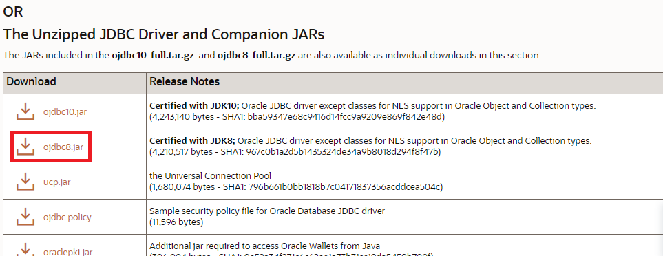
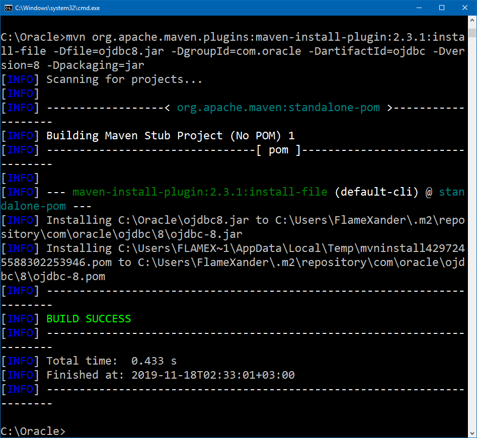

### [Назад к оглавлению](../../../../../../README.md)

# JDBC

>
>[Базы данных](#базы-данных)
>
>[Язык запросов SQL](#язык-запросов-sql)
>
>> [CREATE](#create)
>>
>> [READ](#read)
>>
>> [UPDATE](#update)
>>
>> [DELETE](#delete)
>
>[JDBC](#jdbc)
>
>> [Установка соединения](#установка-соединения)
>>
>> [Запросы в базу](#запросы-в-базу)
>>
>> [Подготовленный запрос](#подготовленный-запрос)
>>
>> [Обработка результатов](#обработка-результатов)
>>
>> [Закрытие ресурсов](#закрытие-ресурсов)
>>
>> [Транзакции в JDBC](#транзакции-в-jdbc)
>
>[Подключение к PostgreSQL](#подключение-к-postgresql)
>
>[Подключение к Oracle](#подключение-к-oracle)
>
>[Практическое задание](#практическое-задание)
>
>[Дополнительные материалы](#дополнительные-материалы)
>
>[Используемая литература](#используемая-литература)
>

# Базы данных

Чтобы начать работу с базой данных, нужно установить систему управления
(СУБД). Примеры таких систем -- MySQL, Oracle, MS SQL, SQLite.

Мы воспользуемся SQLite. Ее особенности:

- хранит всю базу в одном файле;
- не требует установки;
- не поддерживает тип данных Data.

Поддерживаемые типы данных:

- NULL -- NULL-значение;
- INTEGER -- целое знаковое;
- REAL -- с плавающей точкой;
- TEXT -- текст, строка (UTF-8);
- BLOB -- бинарные данные.

# Язык запросов SQL

Аббревиатура CRUD (Create/Read/Update/Delete) обозначает набор операций,
которые можно производить над данными в базе. Они выполняются с помощью
языка запросов SQL. Все команды языка регистронезависимы, могут быть
разделены любым количеством пробелов и переносов строк.

## CREATE

```
CREATE TABLE [имя таблицы] (
[имя колонки] [тип данных],
[имя колонки] [тип данных],
... );
```

Пример запроса:

```sqlite
CREATE TABLE IF NOT EXISTS Students
(
    StudID    INTEGER PRIMARY KEY AUTOINCREMENT NOT NULL,
    Name      TEXT                              NOT NULL,
    GroupName TEXT                              NOT NULL,
    Score     INTEGER                           NOT NULL
);
```

Здесь создается таблица **Students** с полями **ID, Name, GroupName,
Score**.

**NOT NULL** означает, что поле всегда должно быть проинициализировано.
СУБД следит за этим: если поле равно NULL, выдает ошибку.

**PRIMARY KEY** указывает, что поле имеет уникальное значение в этой
таблице. В нашем примере это поле ID -- мы хотим, чтобы у каждой записи
был уникальный номер.

**AUTOINCREMENT** обозначает, что при каждом добавлении записи в таблицу
ей автоматически будет присвоен ID на единицу больше предыдущего.

## READ

Операция чтения данных из таблицы называется SELECT.

```
SELECT [список полей] FROM [имя таблицы] WHERE [условие];
```

Примеры запросов:

```
SELECT * FROM Students;
SELECT * FROM Students WHERE ID > 3
SELECT GroupName FROM Students WHERE ID = 2
```

Символ «*» означает, что мы хотим получить все поля таблицы. Иначе
можно через запятую перечислить необходимые поля. Выражение WHERE не
обязательно, но помогает извлекать только интересные для нас данные.

## UPDATE

Это операция изменения уже присутствующих в таблице данных или
добавления новых.

Добавление новых данных:

```
INSERT INTO [имя таблицы] ([список полей через запятую])
VALUES ([список значений через запятую]);
```

Изменение:

```
UPDATE [имя таблицы]
SET [имя колонки]=[новое значение],
    [имя колонки]=[новое значение],..
WHERE [условие];
```

Примеры запросов:

```
INSERT INTO Students (Name, GroupName, Score)
VALUES ("Bob", "Tbz11", 80);

UPDATE Students SET Score = 90 WHERE Name = "Bob";
```

## DELETE

Удаление данных из таблицы:

```
DELETE FROM [имя таблицы]
WHERE [условие];
```

Пример запроса:

```
DELETE FROM ACCOUNTS
WHERE ID='0';
```

# JDBC

Каждая СУБД разрабатывается конкретной компанией. Чтобы
взаимодействовать с базой данных, производитель выпускает специальный
драйвер -- JDBC. С его помощью устанавливают соединение, изменяют
данные, посылают запросы и обрабатывают их результаты.

Все основные сущности в JDBC API -- это интерфейсы: Connection,
Statement, PreparedStatement, CallableStatement, ResultSet, Driver,
DatabaseMetaData. JDBC-драйвер конкретной базы данных предоставляет их
реализации.

DriverManager -- это синглтон, который содержит информацию о всех
зарегистрированных драйверах. Метод **getConnection** на основании
параметра URL находит **java.sql.Driver** соответствующей базы данных и
вызывает у него метод **connect**.

### Установка соединения

Драйвер JDBC можно скачать с сайта производителя СУБД. Он
распространяется в виде .jar -- библиотеки, которую необходимо
подключить к проекту. Прежде чем использовать драйвер, его нужно
зарегистрировать. Имя драйвера можно найти на сайте разработчиков.

```
// Для SQLite регистрация выглядит следующим образом
Class.forName("org.sqlite.JDBC");
// Для H2 Database - org.h2.Driver
// Для MySQL - com.mysql.jdbc.Driver
```

Исходный код реализации любого драйвера будет содержать статический блок
инициализации:

```java
static {
    try {
        java.sql.DriverManager.registerDriver(new Driver());
    } catch (SQLException e) {
        throw new RuntimeException("Can't register driver!");
    }
}
```

Вызов **Class.forName()** загружает класс и этим гарантирует выполнение
статического блока инициализации, а значит и регистрацию драйвера в
**DriverManager**. Чтобы указать, как найти базу данных, используется
URL -- специальная строка формата
**[protocol]:[subprotocol]:[name]**:

```
protocol: jdbc
subprotocol: sqlite
name: test.db
Connection conn;
conn = DriverManager.getConnection("jdbc:sqlite:mydatabase.db");
// ... Действия с БД ...
conn.close();
```

Объект **Connection** предоставляет доступ к базе данных. Опционально в
него можно передать имя пользователя и пароль, если они установлены.
После окончания работы с базой соединение необходимо закрыть методом
**close()**.

### Запросы в базу

Когда соединение с базой установлено, можно отправлять запросы. Для
этого используется объект **Statement**, который умеет хранить
SQL-команды. В базу можно отправить запрос на получение или изменение
данных. В первом случае результатом будет объект **ResultSet**, который
хранит результат. Во втором -- количество строк таблицы, которые были
изменены.

```
Statement stmt = conn.createStatement();
ResultSet rs = stmt.executeQuery("SELECT * FROM users");
Statement updateStmt = conn.createStatement();
int result = stmt.executeUpdate("INSERT INTO Students (Name, GroupName, Score) VALUES ("Bob", "Tbz11", 80);");
```

### Подготовленный запрос

Для выполнения множества похожих запросов наиболее эффективным и быстрым
решением будет **PreparedStatement** -- скомпилированная версия
SQL-выражения.

В запросах можно использовать параметры: изменять его динамически в
зависимости от входных данных. Параметр заменяется символом «?». Каждому
параметру в запросе присваивается порядковый номер -- индекс, начиная
с 1. У объекта **PreparedStatement** есть методы, которые позволяют
установить параметры. Нужно указать их позицию и значение:

```
PreparedStatement ps = conn.prepareStatement("SELECT * FROM students WHERE id = ?");
ps.
setInt(1,2);
ResultSet rs = ps.executeQuery();
```

**Пакетное выполнение запросов**

Существует возможность отправлять не только отдельные запросы, но и
группировать запросы на изменение данных в пакеты (Batch). В примере
ниже мы группируем 10 операций INSERT в один пакет и разом отправляем
его на выполнение:

```java
private static void prepareStatementBatchExecution() {
    try (PreparedStatement prepInsert = connection.prepareStatement("INSERT INTO students (name, score) VALUES (?, ?)")) {
        for (int i = 1; i <= 10; i++) {
            prepInsert.setString(1, "Bob" + i);
            prepInsert.setInt(2, i * 10 % 100);
            prepInsert.addBatch();
        }
        int[] result = prepInsert.executeBatch();
    } catch (SQLException e) {
        e.printStackTrace();
    }
}
```

Или можно то же самое сделать через Statement:

```java
private static void statementBatchExecution() {
    try {
        for (int i = 1; i <= 10; i++) {
            Statement stmt = connection.createStatement();
            stmt.addBatch(String.format("INSERT INTO students (name, score) VALUES (%s, %d)", "Bob" + i, i * 10 % 100));
        }
        int[] result = stmt.executeBatch();
    } catch (SQLException e) {
        e.printStackTrace();
    }
}
```

Отправка такого пакета выполняется быстрее, чем отправка набора
последовательных запросов и ожидания их выполнения. Кроме того, база
данных может оптимизировать выполнение такого набора запросов, например
часть из них выполнить параллельно. **Важно**: если autoCommit включен,
то каждый запрос из пакета выполняется базой данных в отдельных
транзакциях, и если на каком-то из этапов произойдет ошибка, то будет
выполнена и зафиксирована только часть запросов, и конечно же выполнение
такого пакета займет значительное время из-за коммитов после каждого
запроса. Для ускорения выполнения пакетной операции необходимо выполнять
ее в рамках одной транзакции, и если в момент выполнения возникнет
ошибка, то будет произведен rollback.

### Обработка результатов

Результатом запроса **SELECT** в базу является таблица (набор строк),
которая сохраняется в объекте **ResultSet**. По строкам можно
перемещаться вперед и назад. Для получения значений из определенной
колонки текущей строки можно воспользоваться методами
**get<Type>(<Param>)**, где **Type** -- это тип извлекаемого
значения, а **Param** -- номер колонки (int) или имя колонки (String).

```
ResultSet rs = stmt.executeQuery();
while (rs.next()) {                     // Пока есть строки
  String name = rs.getString(2);        // Или rs.getString("Name");
}
rs.first();                             // Перейти к первой строке
rs.last();                              // Перейти к последней
rs.next();                              // Перейти к следующей
rs.previous();                          // Перейти к предыдущей
```

### Закрытие ресурсов

На каждое соединение СУБД выделяет определенные ресурсы, количество
которых ограничено. Поэтому после окончания работы с объектами
соединения их нужно закрывать.

## Транзакции в JDBC

По умолчанию каждое SQL-выражение автоматически коммитится при
выполнении **statement.execute()** и подобных методов. Чтобы открыть
транзакцию, сначала необходимо установить флаг **autoCommit** у
соединения в значение **false**, а затем пользоваться методами
**commit()** и **rollback()**.

```
conn.setAutoCommit(false);
Statement st = conn.createStatement();
try {
    st.execute("INSERT INTO user(name) values('kesha')");
    conn.commit();
} catch (SQLException e) {
    conn.rollback();
}
```

# Подключение к PostgreSQL

Для начала работы с PostgreSQL необходимо скачать дистрибутив с сайте
разработчика и установить его. После чего в pom.xml Maven проекта
добавляется зависимость:

```
<dependency>
    <groupId>org.postgresql</groupId>
    <artifactId>postgresql</artifactId>
    <version>42.2.5</version>
</dependency>
```

Весь остальной код по базовым возможностям работы с базами данных
(подключение, выполнение запросов, обработка результатов) остается тем
же самым. В качестве url при открытии соединения используется следующий
формат.

```
jdbc:postgresql://<database_host>:<port>/<database_name>

Пример:

jdbc:postgresql://localhost:5432/postgres?currentSchema=app_schema
```

# Подключение к Oracle

Подключить JDBC драйвер для Oracle через центральный репозиторий не
получится, поэтому придется его
скачать: [https://www.oracle.com/database/technologies/appdev/jdbc-ucp-19c-downloads.html](https://www.oracle.com/database/technologies/appdev/jdbc-ucp-19c-downloads.html).



После того как драйвер скачался, его необходимо установить в локальный
Maven репозиторий с помощью maven-install-plugin. Находясь в папке с
jar-файлом выполняем в командной строке следующую команду:

**mvn org.apache.maven.plugins:maven-install-plugin:2.3.1:install-file
-Dfile=ojdbc8.jar -DgroupId=com.oracle -DartifactId=ojdbc -Dversion=8
-Dpackaging=jar**

Результатом будет вот такой вывод в консоль:



Теперь Oracle JDBC драйвер попал в локальный репозиторий, и его можно
спокойно подключать к проекту через Maven зависимость.

```
<dependency>
   <groupId>com.oracle</groupId>
   <artifactId>ojdbc</artifactId>
   <version>8</version>
</dependency>
```

В качестве url при открытии соединения используем вот такой url:

```
try (Connection conn = DriverManager.getConnection( "jdbc:oracle:thin:@localhost:1521:orcldb", "system", "admin")) {

}
```

# Практическое задание

Задание необходимо сдать через Git. [Инструкция](https://docs.google.com/document/d/1tD_AjQss1Qe_qEQ199Mu3sK_jrDt_ADLhxiG9BC7xeM/edit?usp=sharing)

1. Добавить поддержку SQLite в проект
2. Создать класс-репозиторий, отвечающий за взаимодействие с базой данных
3. Организовать запись данных в базу при каждом успешном API запросе. Формат - String city, String localDate, String weatherText, Double temperature
4. Организовать чтение из базы всех данных по пункту меню (требует переработки меню)
5. Учесть, что соединение всегда нужно закрывать

# Дополнительные материалы

1. Кей С. Хорстманн, Гари Корнелл. Java. Библиотека профессионала. Том 1. Основы;
2. Стив Макконнелл. Совершенный код;
3. Брюс Эккель. Философия Java;
4. Герберт Шилдт. Java 8: Полное руководство;

# Используемая литература

Для подготовки данного методического пособия были использованы следующие
ресурсы:

1. Брюс Эккель. Философия Java.

### [Назад к оглавлению](../../../../../../README.md)
