### [Назад к оглавлению](../../../../README.md)

# Оконные функции SQL

Для примеров будем использовать небольшую таблицу, которая показывает оценки учеников по разным предметам. В БД табличка выглядит следующим образом

```sql
--очистка данных таблицы student_grades
truncate student_grades;

--создание таблицы
create table if not exists student_grades
(
    name
        varchar,
    subject
        varchar,
    grade
        int
);

-- наполнение таблицы данными
insert into student_grades
values ('Петя', 'математика', 3),
       ('Петя', 'русский', 4),
       ('Петя', 'физика', 5),
       ('Петя', 'история', 4),
       ('Маша', 'математика', 4),
       ('Маша', 'русский', 3),
       ('Маша', 'физика', 5),
       ('Маша', 'история', 3);

--запрос всех данных из таблицы
select *
from student_grades;
```

SQL часто используется для вычислений в данных различных метрик или агрегаций значений по измерениям. Помимо функций агрегации для этого широко используются
оконные функции.

**Оконная функция в SQL**- функция, которая работает с выделенным набором строк (окном, партицией) и выполняет вычисление для этого набора строк в отдельном
столбце.

**Партиции (окна из набора строк)**- это набор строк, указанный для оконной функции по одному из столбцов или группе столбцов таблицы. Партиции для каждой
оконной функции в запросе могут быть разделены по различным колонкам таблицы.

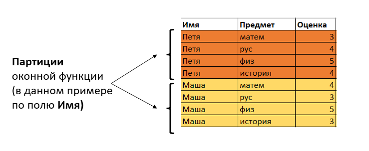

**В чем заключается главное отличие оконных функций от функций агрегации с группировкой?**

Запрос:
```sql
-- пример с группировкой
select name       as Имя,
       avg(grade) as Средняя_оценка
from student_grades
group by name;
```

При использовании агрегирующих функций GROUP BY сокращает количество строк в запросе с помощью их группировки.
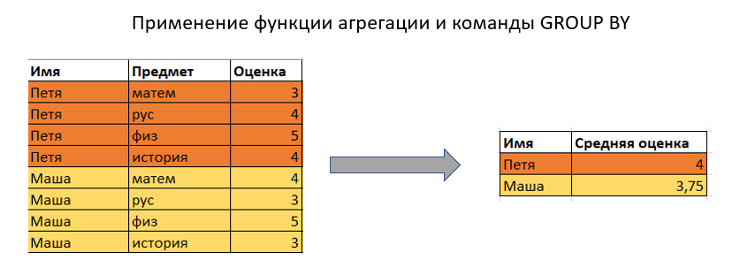

Запрос:
```sql
-- пример с оконной функцией
select name                                as Имя,
       subject                             as Предмет,
       grade                               as Оценка,
       avg(grade) over (partition by name) as Средняя_оценка
from student_grades;
```

При использовании оконных функций количество строк в запросе не уменьшается по сравнении с исходной таблицей.

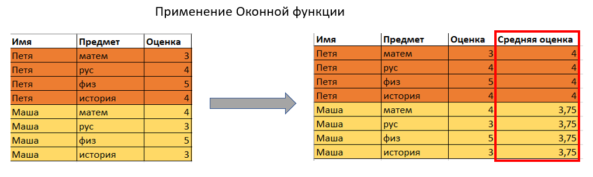

**Порядок расчета оконных функций в SQL запросе**

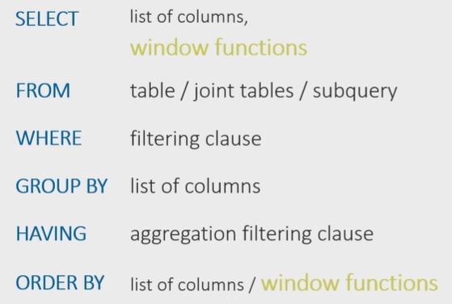

Сначала выполняется команда выборки таблиц, их объединения и возможные подзапросы под командой FROM.

Далее выполняются условия фильтрации WHERE, группировки GROUP BY и возможная фильтрация c HAVING

Только потом применяется команда выборки столбцов SELECT и расчет оконных функций под выборкой.

После этого идет условие сортировки ORDER BY, где тоже можно указать столбец расчета оконной функции для сортировки.

Здесь важно уточнить, что партиции или окна оконных функций создаются после разделения таблицы на группы с помощью команды GROUP BY, если эта команда
используется в запросе.

## Синтаксис оконных функций

Синтаксис оконных функций вне зависимости от их класса будет так или иначе состоять из идентичных команд.

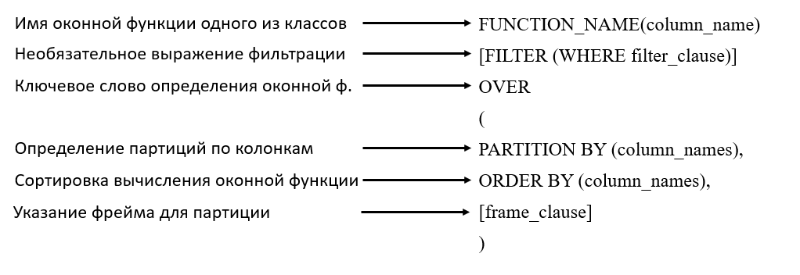

Оконные функции можно прописывать как под командой SELECT, так и в отдельном ключевом слове WINDOW, где окну дается алиас (псевдоним), к которому можно
обращаться в SELECT выборке.

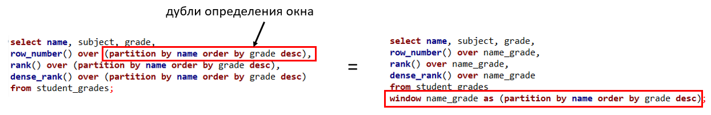

Запросы

```sql
-- синтаксис оконных функций, пример 1
select name,
       subject,
       grade,
       row_number() over (partition by name order by grade desc),
       rank() over (partition by name order by grade desc),
       dense_rank() over (partition by name order by grade desc)
from student_grades;

-- синтаксис оконных функций, пример 2
select name,
       subject,
       grade,
       row_number() over name_grade,
       rank() over name_grade,
       dense_rank() over name_grade
from student_grades
window name_grade as (partition by name order by grade desc);
```

## Классы Оконных функций

Множество оконных функций можно разделять на 3 класса:

- Агрегирующие (Aggregate)
- Ранжирующие (Ranking)
- Функции смещения (Value)

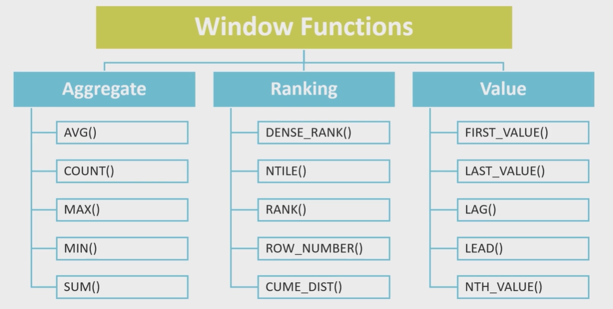

**Агрегирующие:**

Можно применять любую из агрегирующих функций - SUM, AVG, COUNT, MIN, MAX

```sql
-- Агрегирующие
select name,
       subject,
       grade,
       sum(grade) over (partition by name)   as sum_grade,
       avg(grade) over (partition by name)   as avg_grade,
       count(grade) over (partition by name) as count_grade,
       min(grade) over (partition by name)   as min_grade,
       max(grade) over (partition by name)   as max_grade
from student_grades;
```

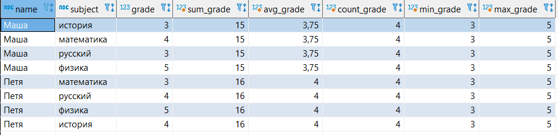

**Ранжирующие:**

В ранжирующих функция под ключевым словом OVER обязательным идет указание условия ORDER BY, по которому будет происходить сортировка ранжирования.

ROW_NUMBER() - функция вычисляет последовательность ранг (порядковый номер) строк внутри партиции, НЕЗАВИСИМО от того, есть ли в строках повторяющиеся значения
или нет.

RANK() - функция вычисляет ранг каждой строки внутри партиции. Если есть повторяющиеся значения, функция возвращает одинаковый ранг для таких строчек, пропуская
при этом следующий числовой ранг.

DENSE_RANK() - то же самое что и RANK, только в случае одинаковых значений DENSE_RANK не пропускает следующий числовой ранг, а идет последовательно.

```sql
-- Ранжирующие
select name,
       subject,
       grade,
       row_number() over (partition by name order by grade desc),
       rank() over (partition by name order by grade desc),
       dense_rank() over (partition by name order by grade desc)
from student_grades;
```

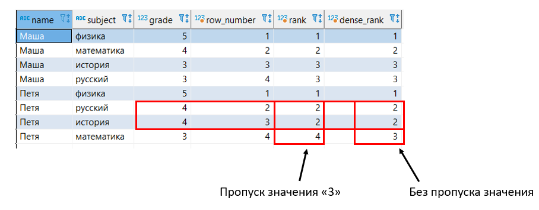

Про NULL в случае ранжирования:

Для SQL пустые NULL значения будут определяться одинаковым рангом

**Функции смещения:**

Это функции, которые позволяют перемещаясь по выделенной партиции таблицы обращаться к предыдущему значению строки или крайним значениям строк в партиции.

LAG() - функция, возвращающая предыдущее значение столбца по порядку сортировки.

LEAD() - функция, возвращающая следующее значение столбца по порядку сортировки.

На простом примере видно, как можно в одной строке получить текущую оценку, предыдущую и следующую оценки Пети в четвертях.

```sql
--создание таблицы
create table if not exists grades_quartal
(
    name
        varchar,
    quartal
        varchar,
    subject
        varchar,
    grade
        int
);

--наполнение таблицы данными
insert into grades_quartal
values ('Петя', '1 четверть', 'физика', 4),
       ('Петя', '2 четверть', 'физика', 3),
       ('Петя', '3 четверть', 'физика', 4),
       ('Петя', '4 четверть', 'физика', 5);

--запрос всех данных из таблицы
select *
from grades_quartal;
```

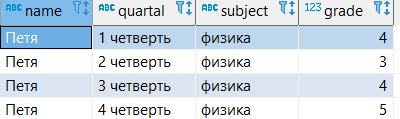

```sql
-- Функции смещения
select name,
       quartal,
       subject,
       grade,
       lag(grade) over (order by quartal)  as previous_grade,
       lead(grade) over (order by quartal) as next_grade
from grades_quartal;
```

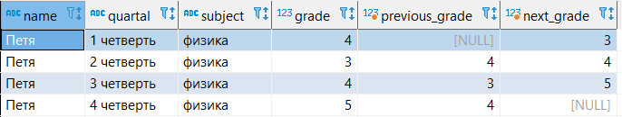

FIRST_VALUE()/LAST_VALUE() - функции возвращающие первое или последнее значение столбца в указанной партиции. В качестве аргумента указывает столбец, значение
которого нужно вернуть. В оконной функции под словом OVER обязательное указание ORDER BY условия.

Дополнительная информация для самоизучения:

+ https://learnsql.com/blog/define-window-frame-sql-window-functions/
+ https://postgrespro.ru/docs/postgresql/15/functions-window
