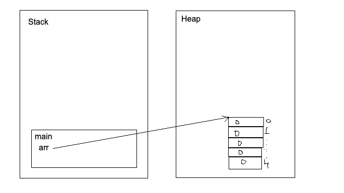
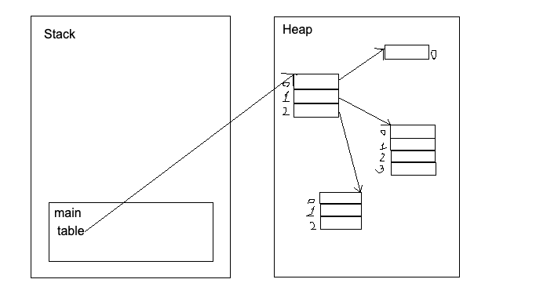

# Основные конструкции

## Циклы for

Циклы позволяют многократно выполнять последовательность кода

```java
for(инициализация;условие;итерация){
        набор_операторов;
        }
```

- _Инициализация_ представлена переменной, выполняющей роль счётчика и управляющей циклом.
- _Условие_ определяет необходимость повторения цикла.
- _Итерация_ задаёт шаг изменения переменной, управляющей циклом.

См. примеры `src/Cycle.java`

## Циклы while

Цикл `while` работает до тех пор, пока указанное условие истинно. Как только условие становится ложным, управление
программой передается строке кода, следующей непосредственно после цикла. Если заранее указано условие, которое не
выполняется, программа в тело цикла даже не попадет.

```java
while(условие){
        набор_операторов;
        }
```

Цикле `do-while` условие проверяется в самом конце. Это означает, что цикл `do-while` всегда выполняется хотя бы один
раз.

```java
do{
        набор_операторов
        };
        while(условие);
```

## Кодовый блок

Кодовый блок представляет собой группу операторов. Для оформления в виде блока они помещаются между открывающей и
закрывающей фигурными скобками.

См. примеры `src/CodeBlock.java`

## Массивы

Массив представляет собой набор однотипных переменных с общим именем.

### Одномерные массивы

При создании массива сначала объявляется переменная, ссылающаяся на него. Затем выделяется память для массива, в Java
динамически распределяется с помощью оператора `new`; ссылка на неё присваивается переменной.

```java
тип_данных[]имя_массива=new тип_данных[размер_массива];
        int[]arr=new int[5];
```

В переменной `arr` сохраняется ссылка на область памяти для массива оператором `new`. Этой памяти должно быть достаточно
для размещения в ней 5 элементов типа `int`. Доступ к отдельным элементам массива осуществляется с помощью индексов.
Индекс обозначает положение элемента в массиве, индекс первого элемента равен нулю. Если массив arr содержит 5
элементов, их индексы находятся в пределах от 0 до 4. Индексирование массива осуществляется по номерам его элементов,
заключенным в квадратные скобки. Например, для доступа к первому элементу массива arr следует указать `arr[0]`, а для
доступа к последнему элементу этого массива — `arr[4]`.



### Получение длины массива

При работе с массивами имеется возможность программно узнать его размер. Для этого можно воспользоваться записью
`имя_массива.length`. Это удобно использовать, когда нужно пройти циклом `for` по всему массиву.

### Двумерные массивы

Среди многомерных массивов наиболее простыми являются двумерные. Двумерный массив – это ряд одномерных массивов. При
работе с двумерными массивами проще их представлять в виде таблицы.

### Нерегулярные массивы

Выделяя память под многомерный массив, достаточно указать лишь первый (крайний слева) размер. Память под остальные
размеры массива можно выделять по отдельности.

```java
int[][]table=new int[3][];
        table[0]=new int[1];
        table[1]=new int[5];
        table[2]=new int[3];
```

Поскольку многомерный массив является массивом массивов, существует возможность установить разную длину массива по
каждому индексу. В некоторых случаях такие массивы могут значительно повысить эффективность работы программы и снизить
потребление памяти, например, если требуется создать очень большой двумерный массив, в котором используются не все
элементы.



См. примеры `src/DoubleArrays.java`
